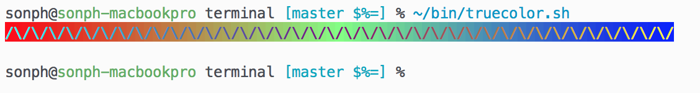

One Half Dark
=============

This color scheme was based from [Sonph's OneHalf](https://github.com/sonph/onehalf)  
Go check his repository for better and more complete themes  


# Vim Installation & Usage


## Installation
### Using a plugin manager (recommended)

Use [Pathogen](http://github.com/tpope/vim-pathogen),
[Vundle](http://github.com/gmarik/vundle),
[Neobundle](http://github.com/Shougo/neobundle.vim) or your favourite Vim
package manager.

To install with Plug

    Plug 'zerodragon/onehalfdark'

in your `.vimrc`, restart vim then execute `:PluginInstall`. This will install
both the color schemes and vim-lightline themes.

## Usage
Put `colorscheme onehalfdark` and `let g:lightline.colorscheme='onehalfdark'` in your `.vimrc`
To set the color scheme and lightline theme. Make sure you have
syntax highlighting on, and 256 colors set. Vim version >= 7.4 recommended.

For example:

    syntax on
    set t_Co=256
    set cursorline
    colorscheme onehalfdark
    let g:lightline.colorscheme='onehalfdark'


### True Colors
By default vim only allows specifying one of the 256 (8 bit) predefined colors
([wikipedia](https://en.wikipedia.org/wiki/ANSI_escape_code#8-bit)).

If you want to match colors in vim and in your terminal exactly, you must enable _true colors_ (24
bit).

In vim/neovim, use `set termguicolors` option:

```
if exists('+termguicolors')
  let &t_8f = "\<Esc>[38;2;%lu;%lu;%lum"
  let &t_8b = "\<Esc>[48;2;%lu;%lu;%lum"
  set termguicolors
endif
```

If you use tmux, you must use version 2.2 or newer. Put this in your config:

```
set -g default-terminal "tmux-256color"
set -ga terminal-overrides ",*256col*:Tc"
```

([source](https://github.com/tmux/tmux/issues/1246))

To test if your neovim/tmux/terminal combination supports true colors or not, use this
[test script](https://github.com/sonph/dotfiles/blob/master/bin/truecolor.sh):


